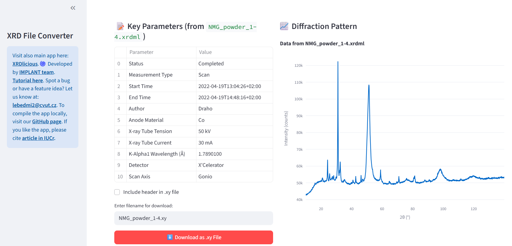

# XRD File Format Converter
Online tool for converting X-ray diffraction data files between formats (.xrdml, .ras, .raw, .xy) and between different X/Y axis (different wavelengths, d-spacing, q-spacing, automatic - divergence slits). 
Submodule of **[XRDlicious](xrdlicious.com)**. 
Access the app here: https://xrd-convert.streamlit.app/

If you like this application, **please cite**: [Lebeda, Miroslav, et al. XRDlicious: an interactive web-based platform for online calculation of diffraction patterns and radial distribution functions from crystal structures. Applied Crystallography, 2025, 58.5.](https://journals.iucr.org/j/issues/2025/05/00/hat5006/index.html)  

# **How to compile and run the XRDlicious locally:** 

### **Prerequisities**: 
- Python 3.x (Tested 3.12)
- Console (For Windows, I recommend to use WSL2 (Windows Subsystem for Linux))
- Git (optional for downloading the code)
  

### **Compile the app**  
Open your terminal console and write the following commands (the bold text):  
(Optional) Install Git:  
      **sudo apt update**  
      **sudo apt install git**    
      
1) Download the code from GitHub (or download it manually without Git on the following link by clicking on 'Code' and 'Download ZIP', then extract the ZIP. With Git, it is automatically extracted):  
      **git clone https://github.com/bracerino/xrd-file-converter.git**

2) Navigate to the downloaded project folder:  
      **cd xrd-file-converter/**

3) Create a Python virtual environment to prevent possible conflicts between packages:  
      **python3 -m venv xrd_env**

4) Activate the Python virtual environment (before activating, make sure you are inside the xrdlicious folder):  
      **source xrd_env/bin/activate**
   
5) Install all the necessary Python packages:  
      **pip install -r requirements.txt**

6) Run the app (always before running it, make sure to activate its Python virtual environment (Step 4):  
      **streamlit run app.py**
